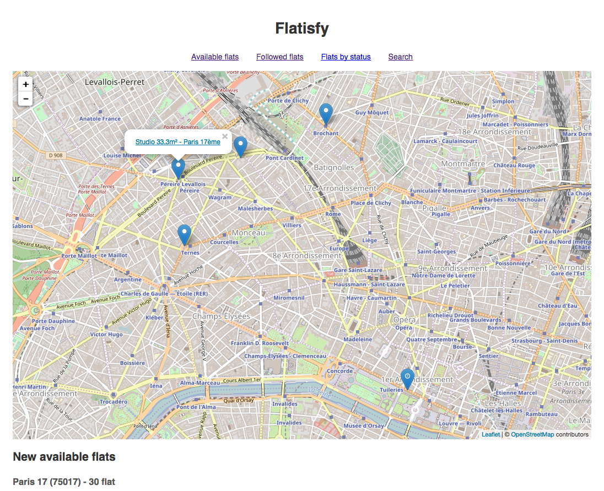
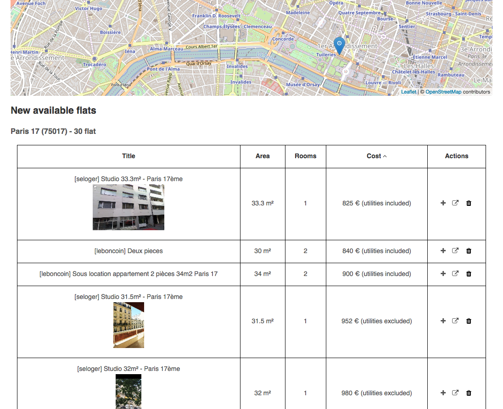
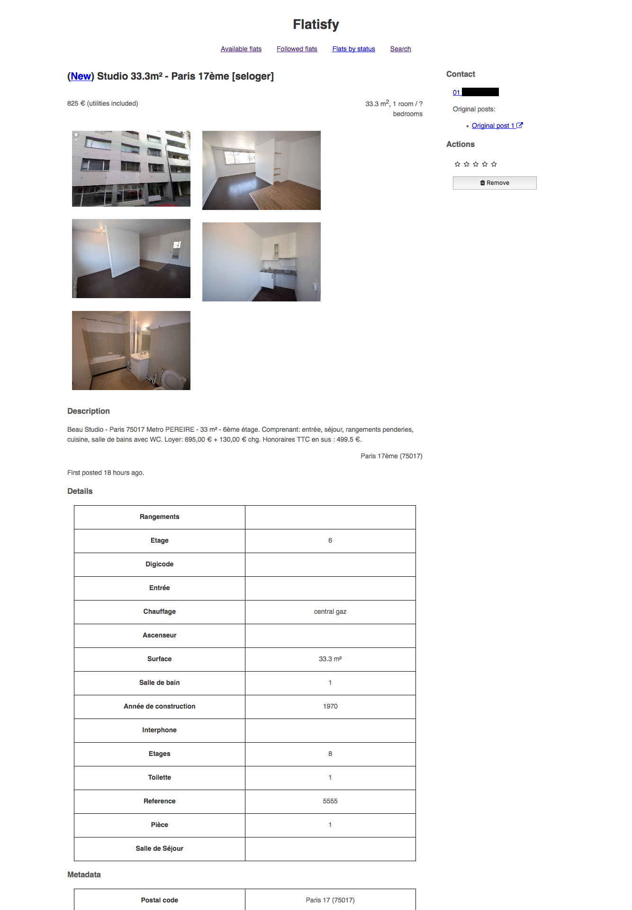
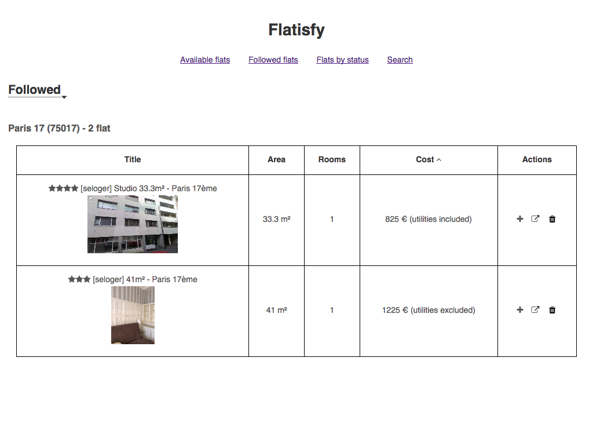

Flatisfy
========

**PROJECT HAS MOVED: Please use
[Framagit](https://framagit.org/phyks/Flatisfy) to create issues on the
project. You can still create merge requests from either
[Github](https://github.com/phyks/flatisfy) or
[Framahit](https://framagit.org/phyks/Flatisfy).**

Flatisfy is your new companion to ease your search of a new housing :)

<noscript></noscript>

**Note**: This software is under heavy development at the moment, and the
database schema could change at any time. Do not consider it as being
production ready. However, I am currently using it for my own housing search
and it is working fine :)

 

It uses [Weboob](http://weboob.org/) to get all the housing posts on most of
the websites offering housings posts, and then offers a bunch of pipelines to
filter and deduplicate the fetched housings.

It can be used as a command-line utility, but also exposes a web API and
visualisation, to browse through the results.

_Note_: It is targeted at French users (due to the currently supported
websites), and in particular at people living close to Paris, as I developped
it for my personal use, and am currently living in Paris :) Any feedback and
merge requests to better support other countries / cities are more than
welcome!

_Note_: In this repository and across the code, I am using the name "flat". I
use it as a placeholder for "housing" and consider both are interchangeable.
This code is not restricted to handling flats only!

## Getting started

See the [getting started guide](doc/0.getting_started.md). If you want to give
it a try quickly, you can have a look at the [Docker image](doc/2.docker.md).

Documentation for the whole app is available
[online](https://doc.phyks.me/flatisfy/).

## Documentation

See the [dedicated folder](doc/).

## Screenshots

### Home page

Display available flats on a map:

And list them with the details in a sortable table:

### Details page

Uniform display of the flat information in a dedicated page, with the contact etc:

### Follow flats

Track interesting flats and store them with notes:

## OpenData

I am using the following datasets, available under `flatisfy/data_files`,
which covers Paris. If you want to run the script using some other location,
you might have to change these files by matching datasets.

* [LaPoste Hexasmal](https://datanova.legroupe.laposte.fr/explore/dataset/laposte_hexasmal/?disjunctive.code_commune_insee&disjunctive.nom_de_la_commune&disjunctive.code_postal&disjunctive.libell_d_acheminement&disjunctive.ligne_5) for the list of cities and postal codes in France.
* [Navitia public transport datasets](https://navitia.opendatasoft.com/explore/?sort=modified&refine.geographicarea=France) for the list of subway/tram/bus stations with their positions in France. These are the `stops_fr-*.txt` files, extracted from the `NTFS` datasets for each region.

Both datasets are licensed under the Open Data Commons Open Database License
(ODbL): https://opendatacommons.org/licenses/odbl/.

## License

The content of this repository is licensed under an MIT license, unless
explicitly mentionned otherwise.

## Contributing

See the `CONTRIBUTING.md` file for more infos.

## API

Your Flatisfy instance is accessible through an API. API documentation is
available
[here](https://doc.phyks.me/flatisfy/flatisfy.web.routes.html#module-flatisfy.web.routes.api).

## Getting help

Feel free to open issues. An IRC channel is available at [irc://irc.freenode.net/flatisfy](irc://irc.freenode.net/flatisfy) as well.

## Thanks

* [Weboob](http://weboob.org/)
* The OpenData providers listed above!
* Navitia for their really cool public transportation API.
* A lots of Python modules, required for this script (see `requirements.txt`).
* [Kresus](https://framagit.org/bnjbvr/kresus) which gave me part of the
  original idea (at least proved me such software based on scraping can
  achieve a high quality level :)
* Current favicon is from [Wikipedia](https://commons.wikimedia.org/wiki/File:Home_Icon.svg)
